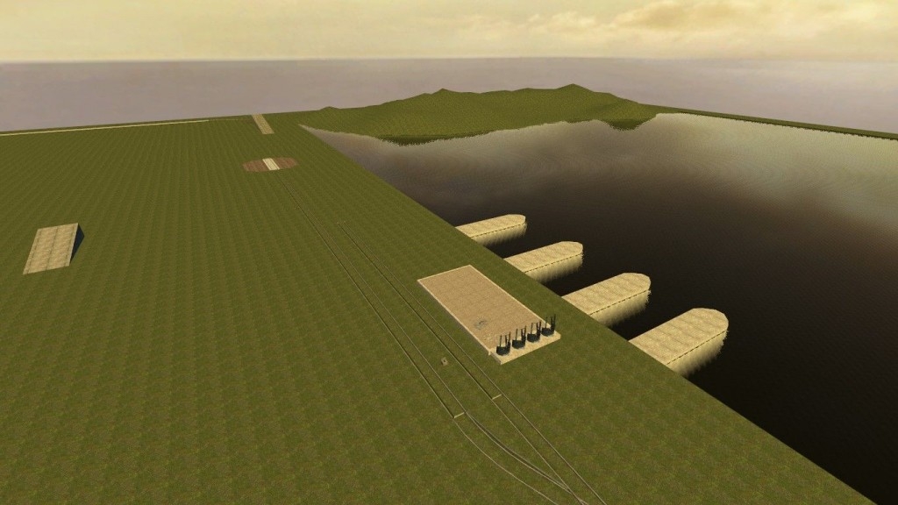
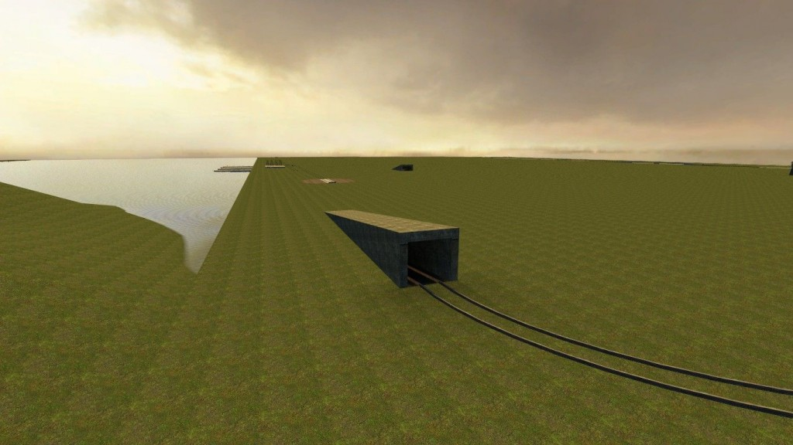
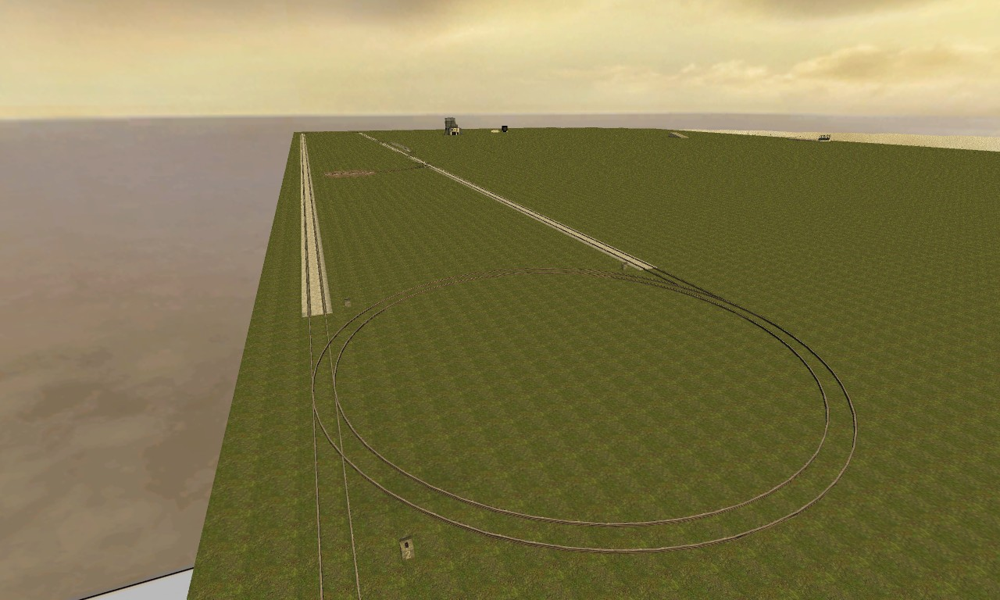
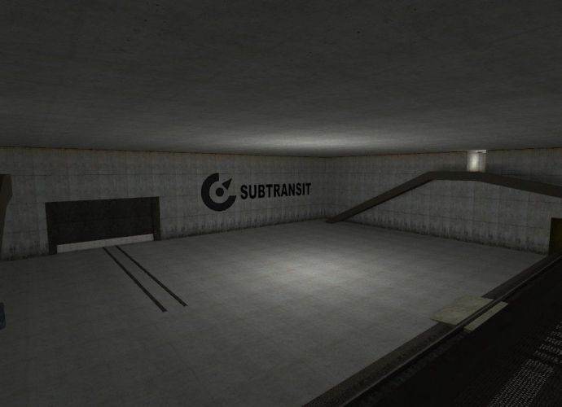
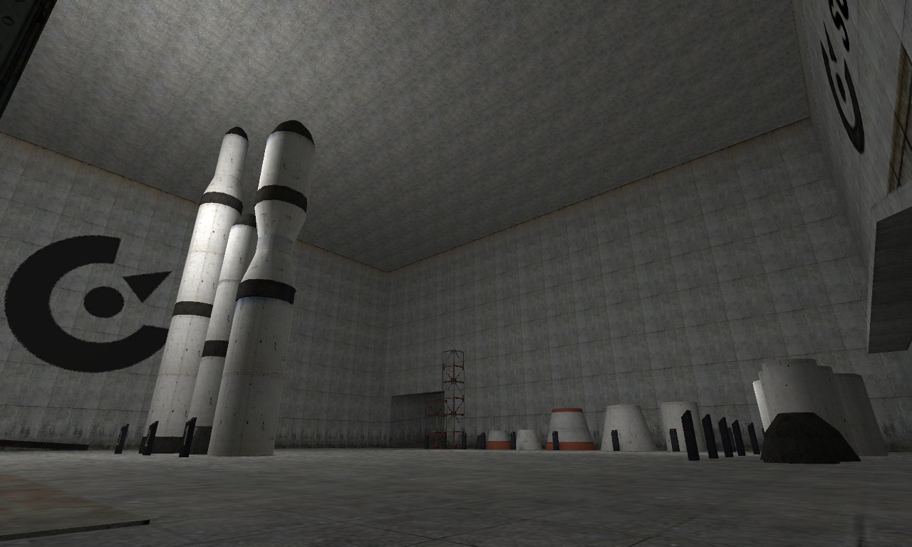
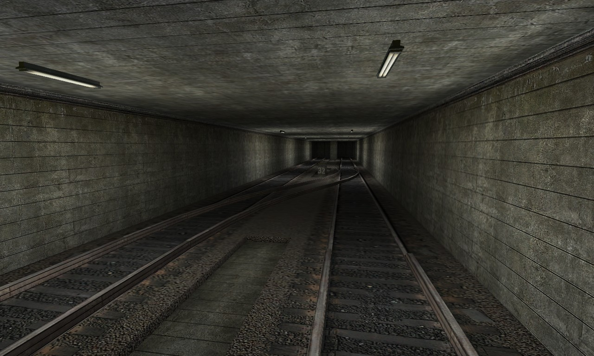
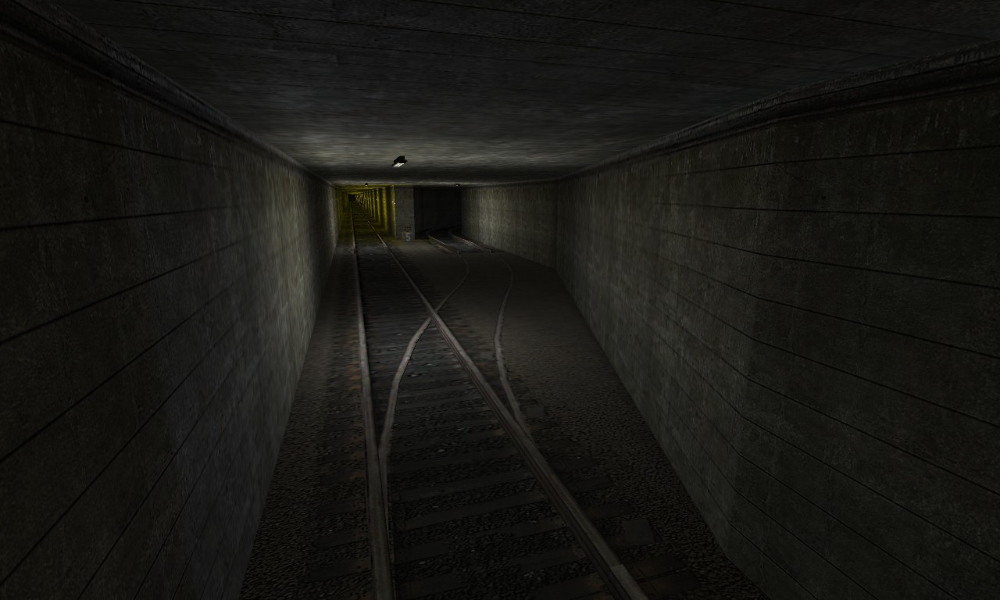
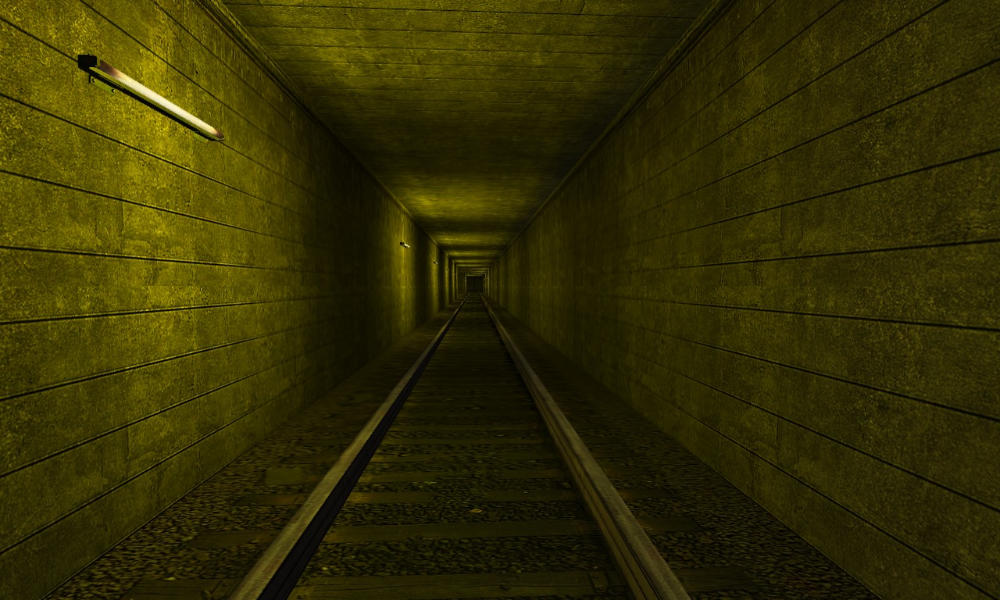

# gm_wireconstruct_rc

The official [Wiremod](http://www.wiremod.com/) map, used to come bundled with [Wiremod](http://www.wiremod.com/).

Map originally conceived and created by [unendingPattern](https://github.com/unendingPattern) and [Black Phoenix](http://steamcommunity.com/profiles/76561197982559015/).

**Features:**

*   Map fills entire space available in source engine.
*   Half-flat, half-water. You can build both water and ground contraptions.
*   Special lighting, which was selected to make your eyes be less tired when playing long game sessions (advantage over fullbrightish maps like gm_flatgrass).
*   Physic rockets and rocket parts that you can use from a silo situated in underground base.
*   Space area in top of the map. You can do some simple space-building here! No gravity for physics objects.
*   Complex overground and underground train track system which is interconnected.
*	Huge underground base.

**Contributions:**

*   [Black Phoenix](http://steamcommunity.com/profiles/76561197982559015/) - Rail system, space, underground complex, silo, rockets.
*   WireMod Team

**Download:** [gm_wireconstruct_rc.zip (6.46 MB (6,775,625 bytes))](gm_wireconstruct_rc.zip)

      
      

Licensed under [Attribution-NonCommercial-NoDerivatives 4.0 International](https://creativecommons.org/licenses/by-nc-nd/4.0/).
